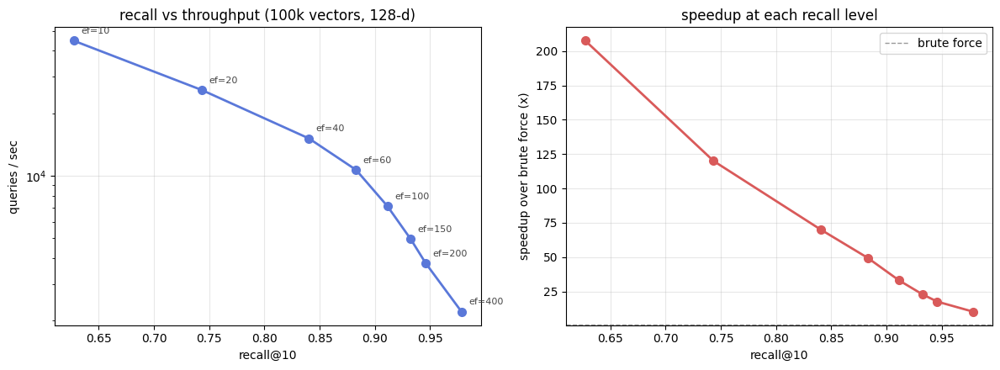

# hnsw-vector-search

a vector search engine in C++. the thing that sits underneath FAISS, Pinecone, and Qdrant, implemented from scratch. it indexes high-dimensional vectors like embeddings and finds the nearest ones to a query in sublinear time using the HNSW algorithm.

header-only, AVX2 accelerated, and benchmarked against an exact brute-force baseline so the recall numbers are real.



## what it does

given a pile of vectors, brute force has to compare a query against every one of them. that is fine until you have a hundred thousand of them and a thousand queries a second. HNSW builds a navigable graph over the vectors so a query only touches a tiny fraction of them while still finding almost all of the true nearest neighbors.

on 100k vectors of dimension 128, this implementation hits **0.95 recall@10 at 17x the throughput of brute force**, and **0.98 recall at 10x**. the full sweep is below.

| ef | recall@10 | queries/sec | speedup vs brute force |
|----|-----------|-------------|------------------------|
| 10 | 0.627 | 44,744 | 208x |
| 40 | 0.840 | 15,109 | 70x |
| 100 | 0.911 | 7,128 | 33x |
| 200 | 0.946 | 3,781 | 17x |
| 400 | 0.979 | 2,208 | 10x |

ef is the one knob that trades recall for speed at query time. higher ef searches more of the graph, finds more true neighbors, runs slower. you pick the point on the curve your application needs.

## how HNSW works

```
       layer 2      *···············*           sparse, long-range links
                    |               |
       layer 1      *·····*·········*······*     medium density
                    |     |         |      |
       layer 0    *·*·*·*·*·*·*·*·*·*·*·*·*·*·*   every point, short-range links

a query enters at the top, greedily walks toward the target through the sparse
long-range links, drops a layer, and repeats. the top layers cover distance
fast, the dense bottom layer refines. it is a skip list generalized to a graph.
```

a point gets assigned a random maximum layer from a geometric distribution, so each layer up is exponentially sparser than the one below. search starts at the single top entry point and descends greedily, then runs a beam search of width ef on layer 0 to collect the final candidates.

## the hard parts

**the neighbor selection heuristic.** when you connect a new point, the obvious move is to link it to its M nearest neighbors. that produces a graph where all your links point into the same dense cluster and the search gets stuck. the heuristic from the paper instead keeps a candidate only if it is closer to the new point than to any neighbor already chosen, which spreads links across directions and gives the graph the long-range edges that make it navigable. getting this exactly right, and resisting the temptation to pad the neighbor list back up to M with the rejected near-duplicates, was the single biggest lever on search quality. padding the lists looked harmless and quietly cut effective throughput by 10x at fixed recall.

**SIMD distance.** distance computation is the inner loop, it runs millions of times per query. the L2 and inner-product kernels have an AVX2 plus FMA path that processes 8 floats per instruction and keeps the accumulator in one register, with a scalar fallback for portability. the results are identical up to floating point reassociation, so the correctness tests pass on either path.

**the visited set.** marking nodes visited during search naively means allocating and zeroing a bitset per query, which on a large index dominates query time. instead there is one array of version stamps and each search bumps a global counter, so a node counts as visited only if its stamp matches the current counter. no per-query allocation, no per-query clearing.

## the intrinsic dimensionality story

this one is worth calling out because it tripped me up and the lesson is real.

early benchmarks on pure i.i.d. gaussian vectors in 128 dimensions gave mediocre recall, around 0.81 at ef=200, and I went hunting for a bug that was not there. the index was correct. pure gaussian noise in high dimensions is the one regime where no graph index can win, because every pair of points is nearly equidistant, there is no structure to exploit, and the true nearest neighbor is barely nearer than the thousandth.

real embeddings do not look like that. they cluster, and they live near a low-dimensional manifold inside the ambient space, their intrinsic dimensionality is far below the vector length. the benchmark generates data with that structure, a low-dimensional latent projected up to 128 dimensions, which is what a sentence-transformer or a CLIP embedding actually produces. on that data the index does what HNSW is supposed to do. the takeaway is that an ANN benchmark is only meaningful on data whose intrinsic dimensionality matches the real workload, and quoting recall without saying what the data looked like is close to meaningless.

## build and run

header-only library, so there is nothing to install. you need a C++20 compiler.

```bash
git clone https://github.com/jashkaransingh/hnsw-vector-search
cd hnsw-vector-search

make test     # build and run the correctness suite
make bench    # build and run the benchmark
make demo     # build and run the usage example
```

the benchmark takes optional arguments for dataset size, dimension, query count, and k.

```bash
./build/benchmark 100000 128 1000 10
```

## use it as a library

```cpp
#include "hnsw/hnsw.hpp"
using namespace hnsw;

HnswConfig cfg;
cfg.M = 16;                 // links per node
cfg.ef_construction = 200;  // build-time candidate list size
cfg.max_elements = 100000;

HnswIndex index(/*dim=*/128, Metric::L2, cfg);
index.add_batch(vectors, n);          // add n vectors

auto results = index.search(query, /*k=*/10, /*ef=*/100);
for (auto& [distance, id] : results) {
    // results are sorted nearest first
}

index.save("index.bin");
auto reloaded = HnswIndex::load("index.bin");
```

metrics are L2, inner product, and cosine. cosine expects L2-normalized vectors, there is a `normalize` helper in `distance.hpp`.

## what's in here

```
hnsw-vector-search/
├── include/hnsw/
│   ├── hnsw.hpp          the index, build and search and persistence
│   ├── distance.hpp      L2 / inner product / cosine, AVX2 + scalar
│   ├── visited_pool.hpp  version-stamped visited sets, no per-query alloc
│   └── brute_force.hpp   exact KNN baseline for recall measurement
├── bench/benchmark.cpp   recall + throughput sweep, writes results/sweep.csv
├── tests/test_hnsw.cpp   correctness suite, 7 test groups
├── examples/demo.cpp     smallest end-to-end usage
├── results/              committed benchmark output and plot
└── Makefile
```

## correctness

the test suite checks the SIMD kernels against their scalar reference, verifies brute force returns sorted exact results, confirms the index retrieves every point as its own nearest neighbor, measures recall against brute force ground truth, checks that higher ef never lowers recall, and round-trips the index through save and load. run `make test`.

## design notes

- M=16 links per node on upper layers, 32 on layer 0, the standard default
- a new node connects to M neighbors, existing nodes are pruned back to the cap only when a back-link overflows them
- IndexFlatIP with L2-normalized vectors gives cosine similarity through inner product
- the graph is stored as flat per-layer adjacency lists, vectors in one contiguous row-major buffer for cache locality

## stack

C++20, AVX2 plus FMA intrinsics with a scalar fallback, a Makefile, and nothing else. the plot is rendered by a short matplotlib script from the CSV the benchmark writes.
